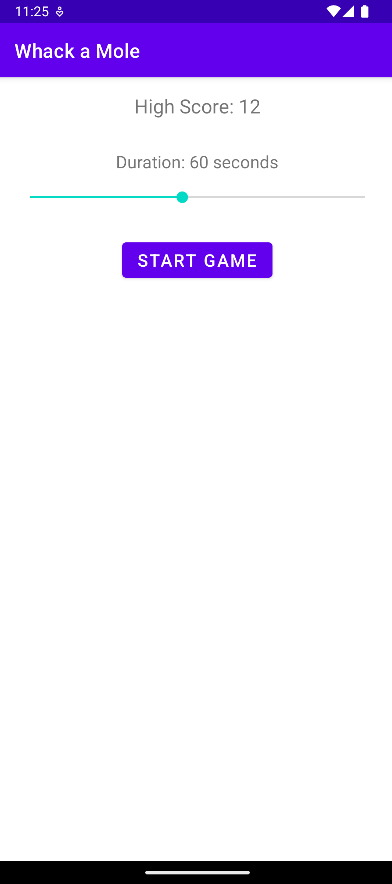
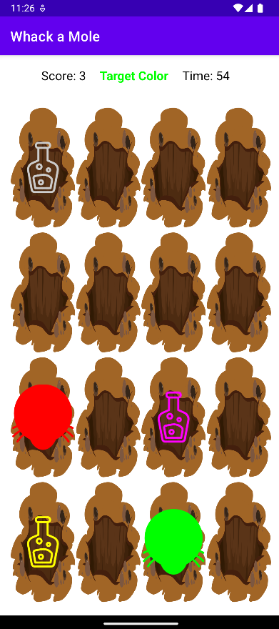
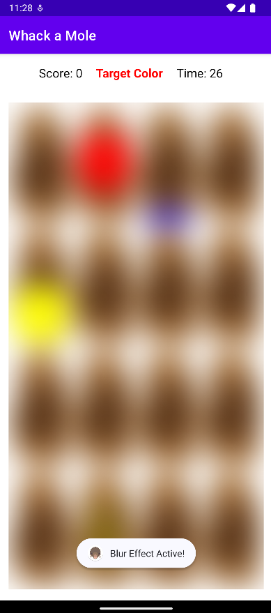
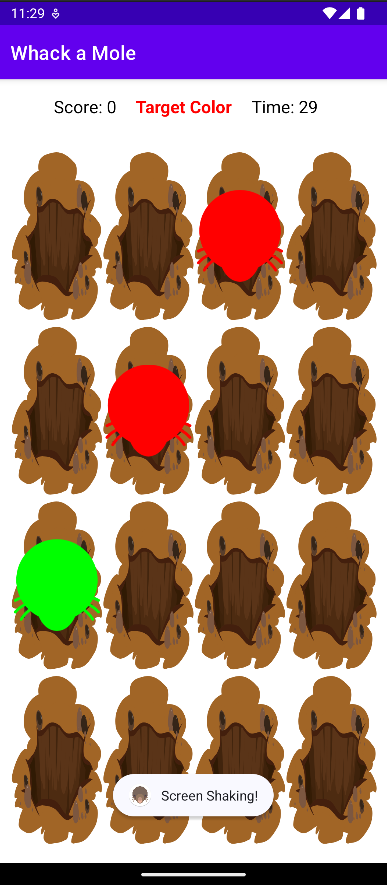

# Whack-a-Mole

## Description

Whack-a-Mole is an Android game where players tap on moles and elixirs that randomly pop up on the screen. The game features various power-ups and challenges to keep the gameplay exciting and enjoyable.

## Technologies Used

- **Java**: The primary programming language for the application (recommended JDK 11 or later).
- **Android SDK**: For building and running the app (uses API 21 as `minSdk`, API 34 as `targetSdk`).
- **Gradle**: For project build automation (uses version 8.0).
- **XML**: For defining UI layouts and resources.

## Features

- **Random Mole and Elixir Appearance**: Moles and elixirs appear in random holes on the screen.
- **Power-ups**:
  - Double Points: Increases points earned for a limited time.
  - Negative Points: Deducts points for missed taps.
  - Screen Shake: Adds a visual effect to make gameplay more challenging.
  - Blur Effect: Temporarily blurs the screen for an extra challenge.
- **Score Tracking**: Tracks and displays the player's current score.
- **Timer**: A countdown timer limits the game duration.
- **High Score**: Saves and displays the highest score achieved by the player.

## Prerequisites

- **Android Studio**: The official IDE for Android development (recommended version Iguana or later, [download here](https://developer.android.com/studio)).
- **Java Development Kit (JDK)**: Required to compile and run the app (recommended JDK 11, [download here](https://www.oracle.com/java/technologies/javase-jdk11-downloads.html)).
- **Android Device or Emulator**: To run and test the app (minimum Android version: 5.0, API 21).

## Getting Started

### Clone the Repository

```sh
git https://github.com/WinterWollf/Whack-a-Mole.git
cd Whack-a-Mole
```

### Open the Project in Android Studio

1. Open Android Studio.
2. Click on `File` -> `Open`.
3. Navigate to the cloned `Whack-a-Mole` directory and select it
4. Click `OK` to open the project.
5. Wait for Android Studio to complete the Gradle synchronization.

### Build and Run the Application

1. Connect your Android device or start an emulator.
2. Build the project `Build > Rebuild Project`
3. Click on the `Run > Run 'app'` or press `Shift + F10`.
4. Select your device/emulator and click `OK`.

## Screenshots

Here are some screenshots showcasing the main features of the application:

### Start screen



### Gameplay



### Blur effect



### Shaking effect



## License

This project is licensed under the Creative Commons Attribution-NonCommercial 4.0 International (CC BY-NC 4.0) License - see the [LICENSE](LICENSE.txt) file for details.

## Contact

For any inquiries or feedback, feel free to reach out to the project author:
- **GitHub**: [WinterWollf](https://github.com/WinterWollf)

---
